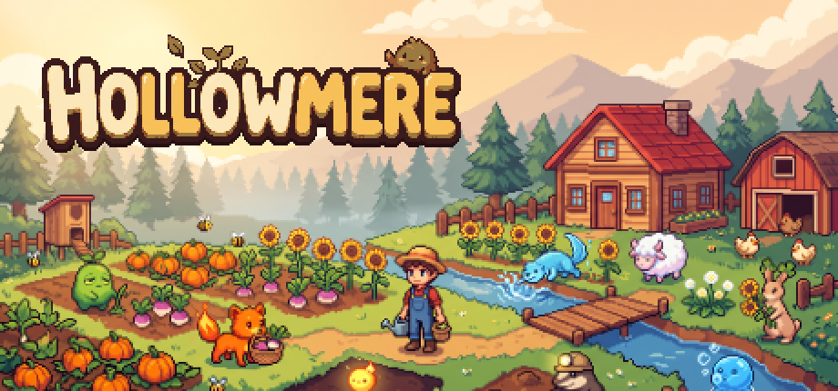
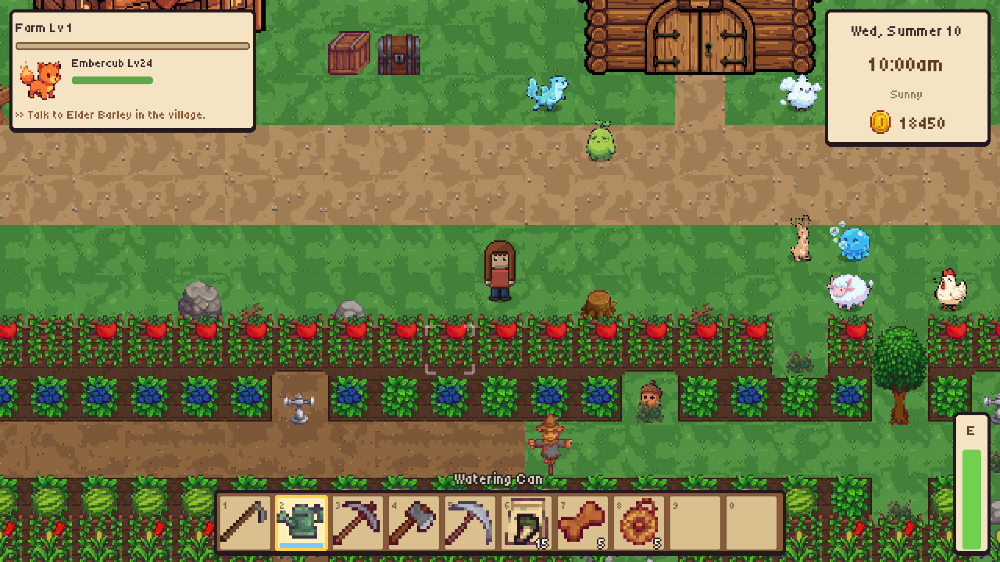
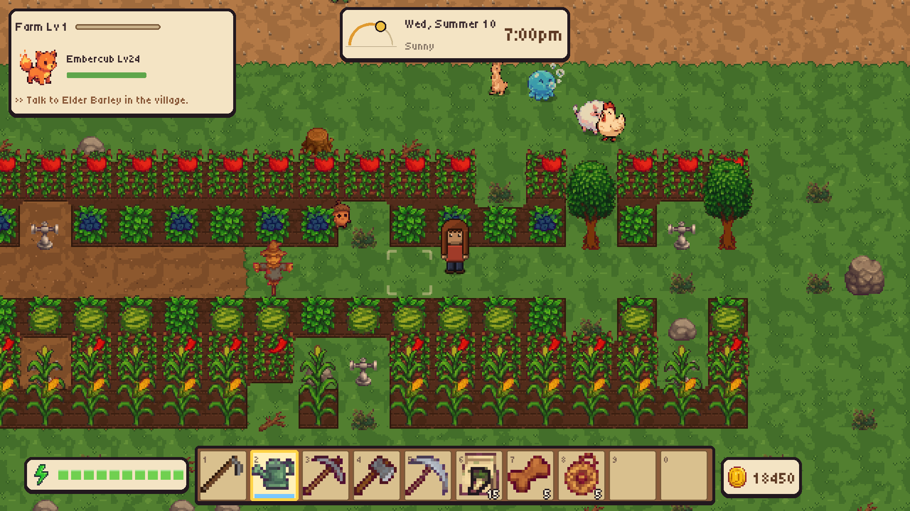
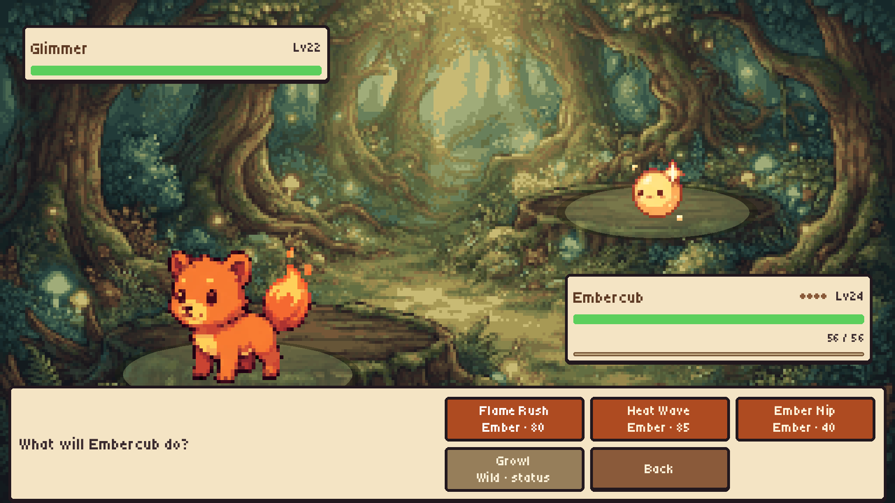
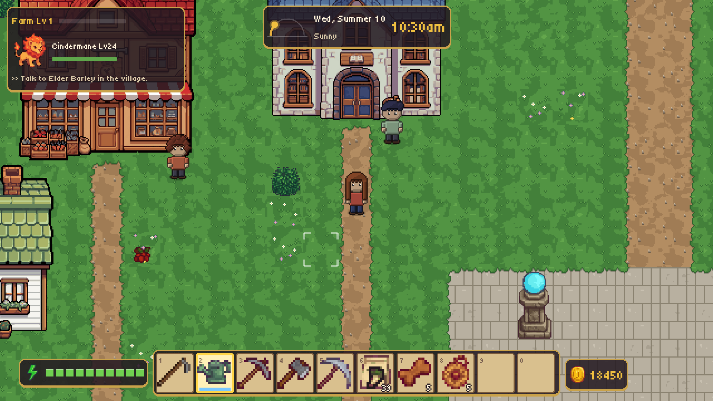
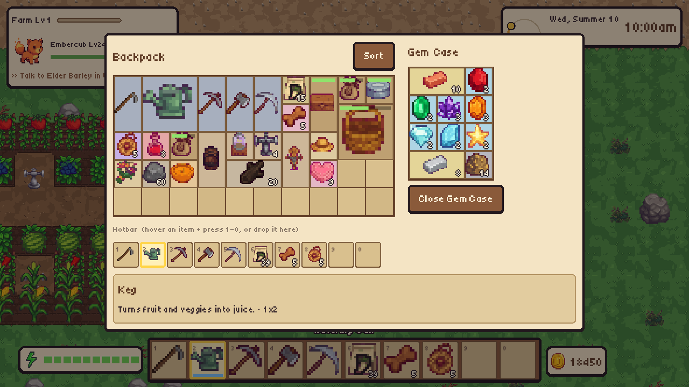
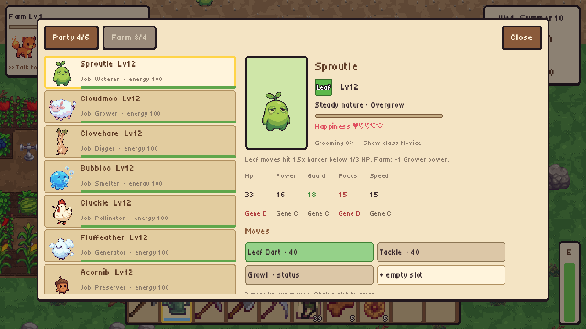
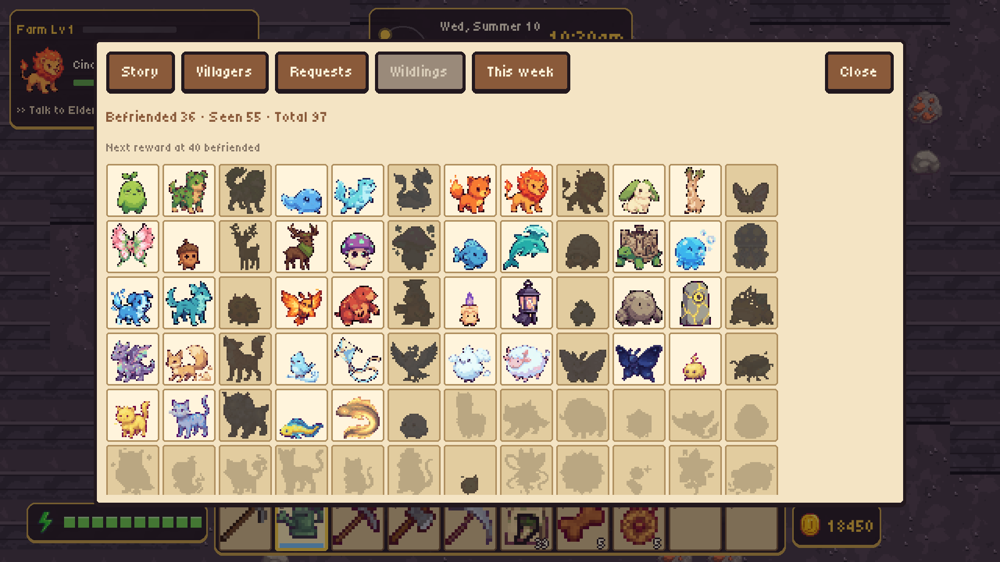
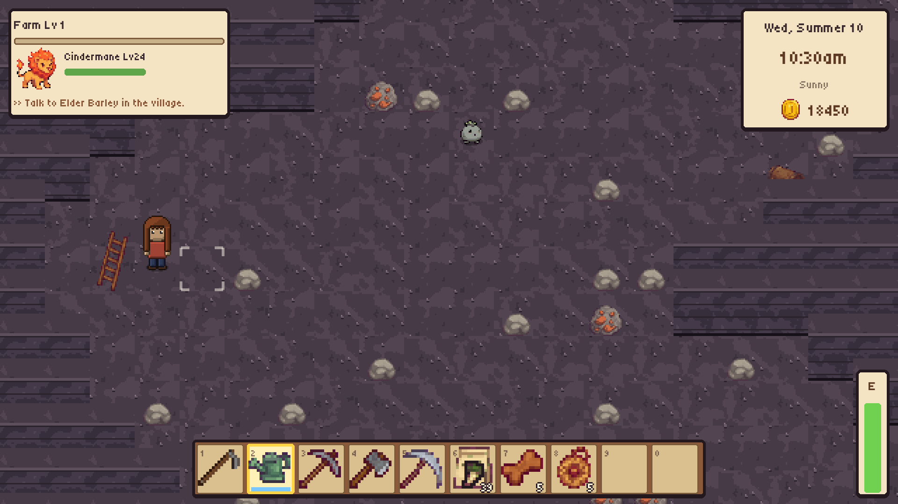

<p align="center">
  
</p>

<h1 align="center">Hollowmere</h1>

<p align="center">
  A cozy Godot 4 farming game where the creatures you befriend live on your farm and work it with you.
</p>

<p align="center">
  <a href="https://github.com/robintrepte/hollowmere/actions/workflows/build.yml"></a>
  
  
  
  
</p>

<p align="center">
  <a href="#play">Play</a> ·
  <a href="#screenshots">Screenshots</a> ·
  <a href="#features">Features</a> ·
  <a href="#run-it-locally">Run locally</a> ·
  <a href="HOSTING.md">Host it</a> ·
  <a href="RELEASE.md">Release</a>
</p>

Inherit your grandmother's overgrown farm in a hidden valley and befriend **97 Wildlings**. They water crops, guard fields and fight beside you in turn-based battles. Farm, breed, explore nine regions, get to know the village, and play it together in online co-op.

The same account and cloud saves work in the **browser** (installable home-screen web app), on **Windows** and on **macOS**.

## Screenshots

<p align="center">
  
  
</p>
<p align="center">
  
  
</p>
<p align="center">
  
  
</p>
<p align="center">
  
  
</p>

## Features

- **97 Wildlings** to befriend, raise, breed and battle
- **10 farm jobs** — watering, growing, clearing, smelting, pollinating, powering machines, preserving, guarding, luck and harvesting
- **Turn-based 1v1 battles** — 10 types, 79 moves, natures, traits, genes and switching
- **A life in the valley** — 40 crops, four seasons, festivals, cooking, crafting, 20 villagers (8 you can court)
- **Nine regions** — each frontier has a Warden, a shrine and a mine
- **Grid inventory** — items take real space, rotate, and nest inside pouches and cases
- **Online co-op** — host-authoritative farms, trading and friendly PvP
- **Play anywhere** — Windows, macOS, mobile browser + Add to Home Screen, full controller support

Store copy and capsule art live in [`store/STORE_PAGE.md`](store/STORE_PAGE.md).

## Play

| Build | How |
|---|---|
| Browser | Host the web export (see [HOSTING.md](HOSTING.md)) and open `https://play.example.com` |
| Phone | Same URL, landscape. Safari / Chrome → **Add to Home Screen** for fullscreen |
| Desktop | Windows and macOS exports from CI (`v*` tags) or a local Godot export |

Accounts: email, guest, or Google. Cloud saves and co-op go through Nakama on your own server.

## Run it locally

Needs **Godot 4.7.2**. Drop the editor at `.tools/Godot.app` (macOS) or put `godot` on your `PATH`.

```bash
# Game only (offline, local saves, no accounts / co-op)
godot --path game
```

Backend (accounts, cloud saves, co-op) is Docker:

```bash
cd server
cp .env.example .env          # defaults are fine on localhost
docker compose up -d --build
# API  http://127.0.0.1:7350
# Console http://127.0.0.1:7351  (admin / localdevpassword)
```

Then run the game again. `game/project.godot` already points debug builds at `127.0.0.1:7350`.

```bash
# Compile check, unit tests, one smoke
godot --headless --path game res://tests/check_scripts.tscn
godot --headless --path game -s addons/gut/gut_cmdln.gd -gconfig=res://.gutconfig.json
godot --path game res://tests/smoke/smoke.tscn
```

Release checklist, signing, itch and Steam: [RELEASE.md](RELEASE.md).

## Host it

Production is a **Hetzner Ubuntu** box, **nginx** on the host, Docker only for Nakama + Postgres. The guide is written for humans and agents: one variable block at the top, then copy-paste commands.

**[HOSTING.md](HOSTING.md)** — DNS, nginx + certbot, secrets, first web deploy, GitHub Actions, backups.

Example: `play.example.com` → your VPS. Replace the names in the variable block and keep going.

## Repo map

```
game/          Godot 4.7 project (scenes, data, i18n, tests)
server/        Nakama + Postgres compose, Lua module, nginx site template
store/         Steam / itch capsules and 1920×1080 screenshots
tools/         Art pipeline, string extraction, web fingerprint + precompress
.github/       CI: 156 tests, Windows / macOS / Web export, tagged deploy
```

CI (every push and PR): script compile, GUT, translation template check, 112-day balance sim, Nakama integration, co-op and 4-peer desync tests, then Windows / macOS / Web exports. Tagged `v*` releases can sign macOS, push itch and rsync the web build.

## Made with

Godot 4, Nakama, pixel art through a small Replicate → quantize → atlas pipeline (`tools/art_pipeline`). Copyright [Robin Trepte](https://github.com/robintrepte). MIT — see [LICENSE](LICENSE).
